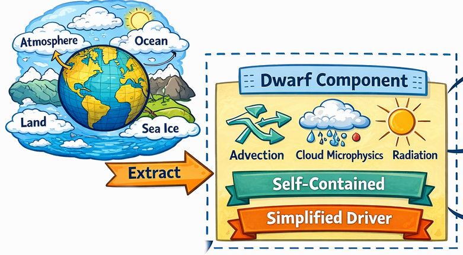
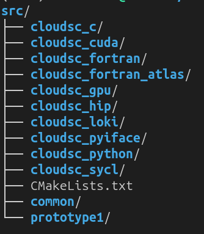
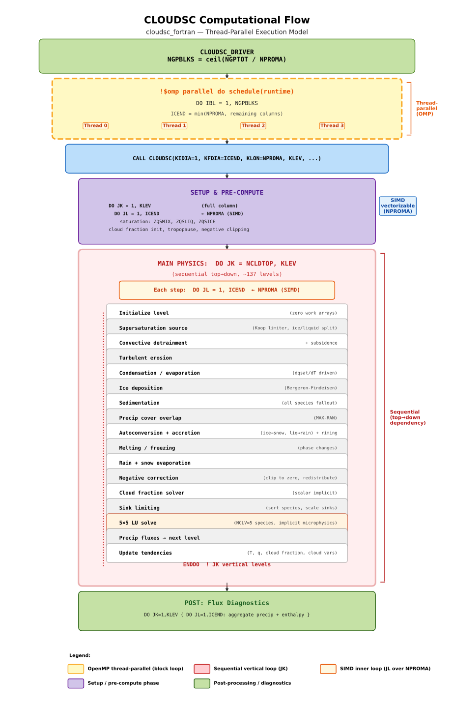
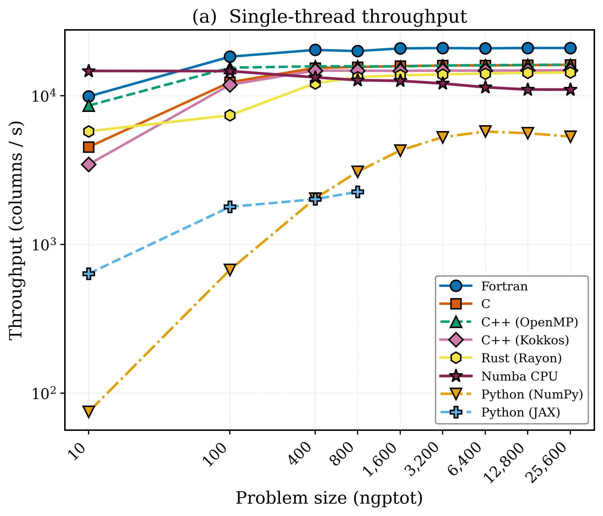
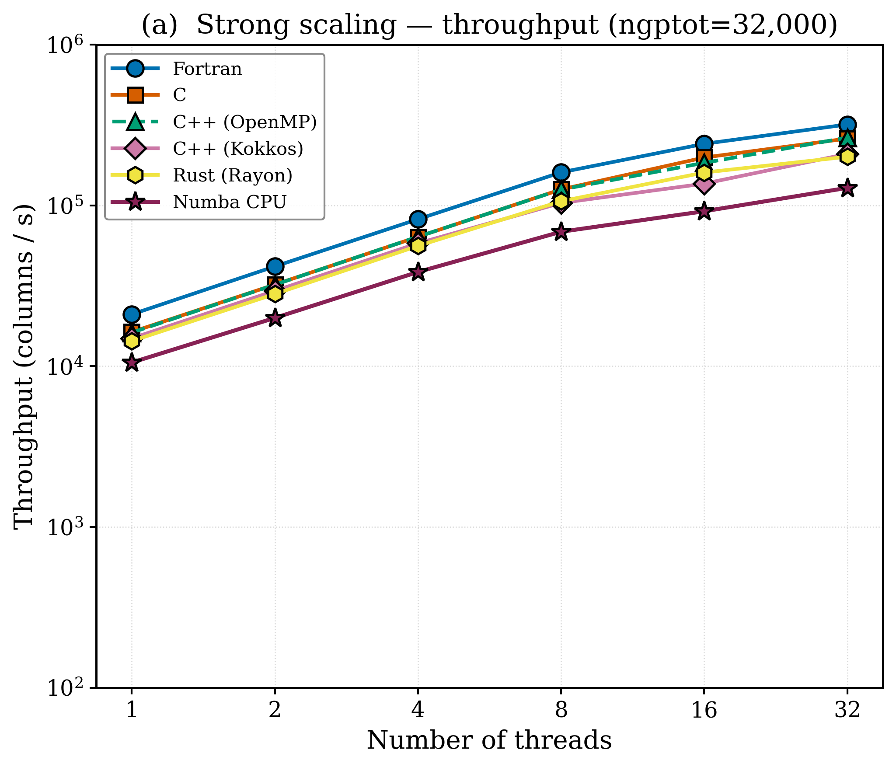
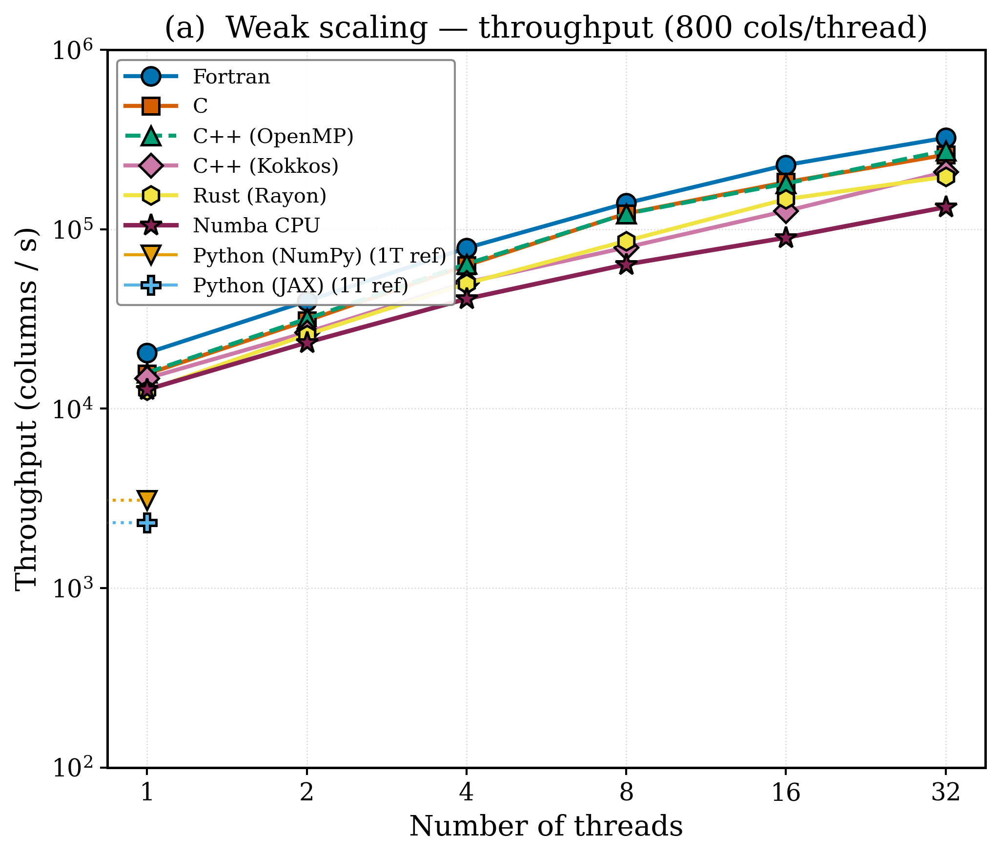
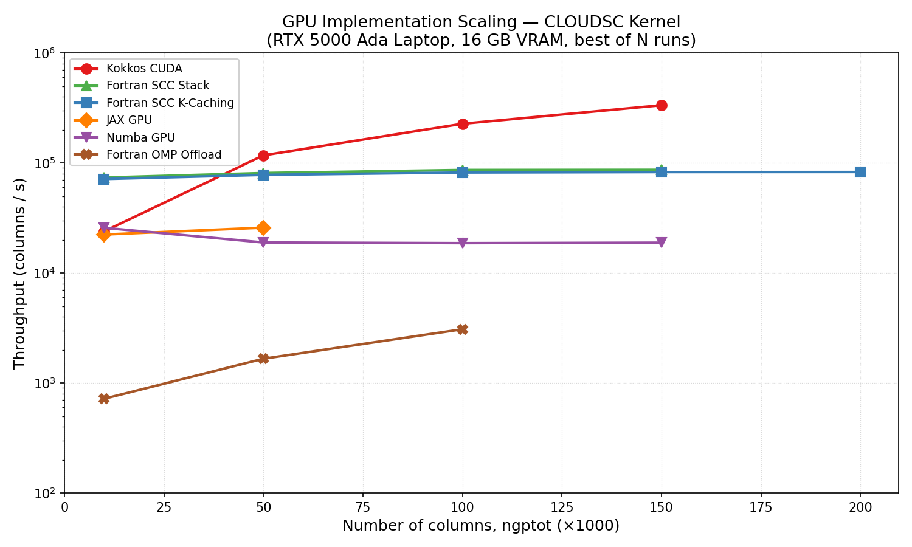

# Demonstrator

---
layout: default
title: Demonstrator
subtitle: AI Augmented Code Translation of a climate Model Dwarf
---

A **dwarf** is a self-contained, functional kernel extracted from a full climate model
(e.g., advection, radiation, cloud microphysics, sea-ice).

- Runs independently of full model infrastructure with a simplified driver (main)
- Preserves numerical structure and algorithmic complexity  
- Enables controlled experimentation  with fixed inputs and validation outputs

**Purpose**
- Idealized experiments
- Explore alternative implementations  
- Performance and portability studies  

---
layout: two-cols
title: Demonstrator
subtitle: IFS-cloud Microphysics Dwarf
density: compact
---

<v-click>

<Block type="default" title="Column Physics Parametrization" compact>

Scheme for cloud and precipitation processes in the IFS, described by prognostic equations for cloud liquid water, ice, (LS) rain, (LS) snow and (LS) fractional cloud cover.

</Block>

</v-click>

<v-click>

<Block type="info" title="Mature Dwarf with Multiple Implementations" compact>

CPU and GPU backends, programming languages and optimizations: Fortran, OpenACC, CUDA, C etc.

</Block>

</v-click>

::right::

<v-click>

<Block type="success" title="Cleanly Isolated Compute Kernel" compact>

General archetype for column physics parametrization: nested loops with inner serial vertical dimension loop, outer loop over multiple grid columns, matrix solver (LU decomposition), 2 Newton-Raphson iterations.

</Block>

</v-click>

<v-click>

<Block type="warning" title="Reference Inputs & Validation Outputs" compact>

- HDF5 based inputs and outputs for 100 columns
- Can be replicated for more sizes (ngptot)
- Useful for scaling and validation tests

</Block>

</v-click>

<v-click>

Thanks to ECMWF devs — https://github.com/ecmwf-ifs/dwarf-p-cloudsc and Nils Wedi.

</v-click>

---
layout: default
title: Demonstrator
subtitle: CPU compute kernel architecture
density: compact
---

main() 
&nbsp;└─► cloudsc_driver(nthreads, ncols, nproma) 
&nbsp;&nbsp;&nbsp;&nbsp;&nbsp;│ 
&nbsp;&nbsp;&nbsp;&nbsp;&nbsp;└─► #pragma omp parallel for 
&nbsp;&nbsp;&nbsp;&nbsp;&nbsp;&nbsp;&nbsp;&nbsp;&nbsp;FOR b = 0 TO nblocks-1: ← BLOCK (parallel) 
&nbsp;&nbsp;&nbsp;&nbsp;&nbsp;&nbsp;&nbsp;&nbsp;&nbsp;&nbsp;└─► cloudsc_c(kidia, kfdia, ...) 
&nbsp;&nbsp;&nbsp;&nbsp;&nbsp;&nbsp;&nbsp;&nbsp;&nbsp;&nbsp;&nbsp;&nbsp;&nbsp;&nbsp;│ 
&nbsp;&nbsp;&nbsp;&nbsp;&nbsp;&nbsp;&nbsp;&nbsp;&nbsp;&nbsp;&nbsp;&nbsp;&nbsp;&nbsp;└─► FOR jk = ncldtop TO klev: ← LEVEL (seq) 
&nbsp;&nbsp;&nbsp;&nbsp;&nbsp;&nbsp;&nbsp;&nbsp;&nbsp;&nbsp;&nbsp;&nbsp;&nbsp;&nbsp;&nbsp;&nbsp;&nbsp;&nbsp;&nbsp;│ 
&nbsp;&nbsp;&nbsp;&nbsp;&nbsp;&nbsp;&nbsp;&nbsp;&nbsp;&nbsp;&nbsp;&nbsp;&nbsp;&nbsp;&nbsp;&nbsp;&nbsp;&nbsp;&nbsp;└─► FOR jl = kidia TO kfdia: ← COL (vec) 
&nbsp;&nbsp;&nbsp;&nbsp;&nbsp;&nbsp;&nbsp;&nbsp;&nbsp;&nbsp;&nbsp;&nbsp;&nbsp;&nbsp;&nbsp;&nbsp;&nbsp;&nbsp;&nbsp;&nbsp;&nbsp;&nbsp;&nbsp;&nbsp;└─► physics(jl, jk)

<v-click>

</v-click>

<!--
Cloud microphysics solves the evolution of cloud and precipitation hydrometeors — water vapor, cloud liquid, cloud ice, rain, snow, and graupel — through processes such as condensation, evaporation, autoconversion, accretion, sedimentation, and ice nucleation.

The equations govern mass and number concentration tendencies for each species, coupled through source/sink terms.

The computational structure involves nested loops: an outer loop over horizontal grid columns and an inner loop over vertical levels, with microphysics computed column-by-column. The image on the right shows the version tree of available implementations.

dwarf provides reference implementation and performance benchmarks.
Question is can we use AI to translate to different backends. here is the prompt.
-->
 
---
layout: default
title: Translation Prompt Template
subtitle: Reusable prompt for AI-assisted Fortran kernel translation
---

<v-click>

- Translate to different programming languages in future development pathways and evaluate performance and scaling. 
</v-click>

<v-click>

- Used preprocessed code of `cloudsc_fortran` as Fortran reference, and `cloudsc_c` C as secondary reference.
</v-click>

<v-click>

- Made a copy with only Fortran and C implementations to prevent accedental reference implementation leaks to LLM.
</v-click>

<v-click>

<ScrollableMarkdown src="02demonstrator/cloudsc-fortran-translation-template.md" maxHeight="320px" fontSize="0.8em" />
</v-click>

<v-click>

- Template evolved iteratively from first CPU translations. 
</v-click>
---
layout: two-cols
title: AI-Code Translation Benchmarks
subtitle: CPU, single thread
ratio: '3:1'
---

- Single thread benchmark is important because it measures efficiency of a port to use vectorization on CPU archetectures w.r ro reference FOrtran and C. 
- Most lower level implementations scale (including Rust) but Fortran standsout. 
- For Python based implementations: numba is promissing, Jax uses too much memory and OOMs. 

::right::

The metric Throughput (cols/s) = NGPTOT / wall_time. 

Desirable to have increase or constant for increased sizes for non interacting column physics.

---
layout: two-cols
title: AI-Code Translation Benchmarks
subtitle: CPU, multithreading (OMP, native threading)
---

- Strong scaling: fixed problem size (ngptot=32000) evaluate speedup as we increase threads.
- Expect linear increase in throughput: faster as we add more threads.
- All implementations scale to about 8 threads (possibly hardware dependent).

::right::

- Weak scaling: increase problem size linearly with threads (ngptot=800 for 1 thread) 
- Expect linear increase in throughput: same throughput for same load on a thread.
- Rust used internal threading (rayon) others used openmp for threading. 
---
layout: two-cols
title: AI-Code Translation Benchmarks
subtitle: GPU
---

- Fortran reference `cloudsc_gpu` has ~11 reference implementations using openACC that use SCC kernel.
- SCC: single column coalased makes sure that each GPU thread gets one column, massively parallel.  This is unlike CPU kernels where each cpu-thread uses NPROMA number of columns in serial loop for vectorization. 
- Selected top 2 performing fortran SCC kernels as reference.

::right::
- Surprisingly fortran SCC kernels tuned for massive parallism dont scale.
- C++/Kokkos that used nproma style kernel, more columns for a gpu thread, scales much better.
- Not enough compute intensity per thread for this dwarf.
- Clearly Microphysics Dwarf is memory bound.
- Jax designed for massively problems also doesn't scale and OOMs out. Test with SCC like kernel.

---
layout: default
title: Demonstrator
subtitle: Summary
---

- AI editors can port Fortran to C++, Rust, Python Frameworks and restructure Kernels.

- A self-sufficient Dwarf is powerful and breakthrough enabler.

- Performance is competative in many cases. 

- Among the alternative unified source frameworks: C++ with kokkos seems to be most mature, numba is promising, and jax is intruging.

- GPU scaling suggests Micro Physics Dwarf is low compute intensity and memory bound: other dwarfs like radiation?

- Good value in exploring atlas as backend as it can be used with different Frameworks and grids.
 
- Would be useful to evaluate ability to port Fortran to Fortran for different hardware backends.
 

<Block type="success" title="" compact>

AI editors can generate scalable, performant scientific kernels today -- not perfect but real. **Question is how do we structure our model to allow AI to help and not can AI do this**

</Block>